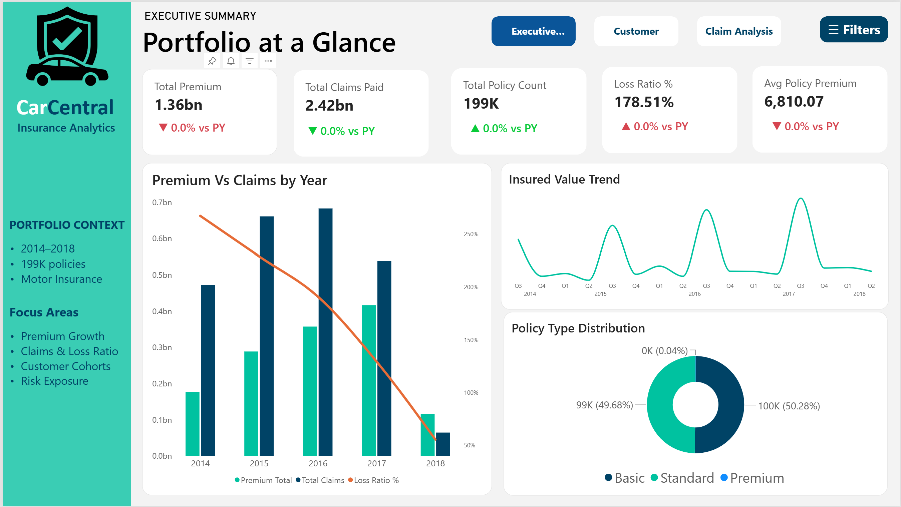
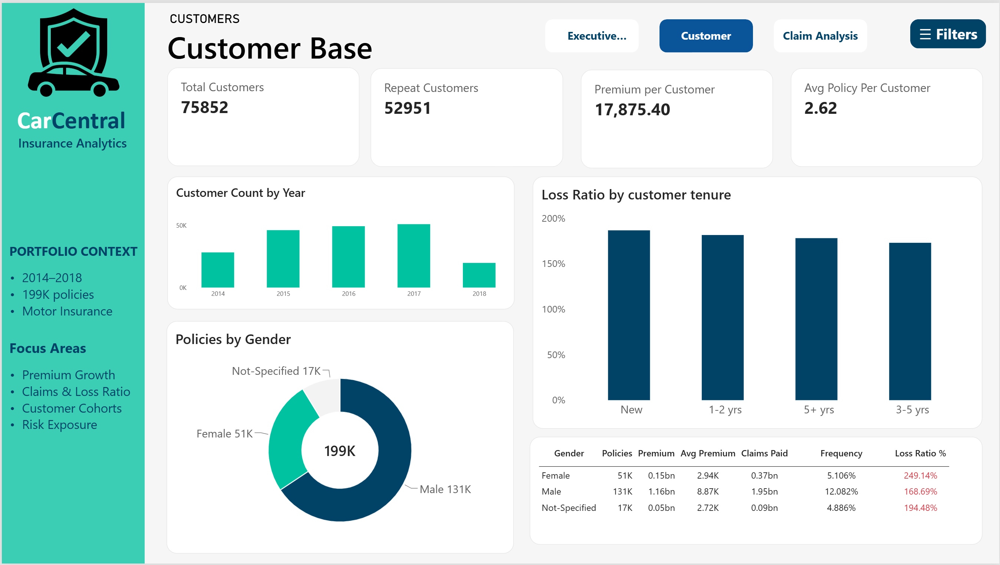
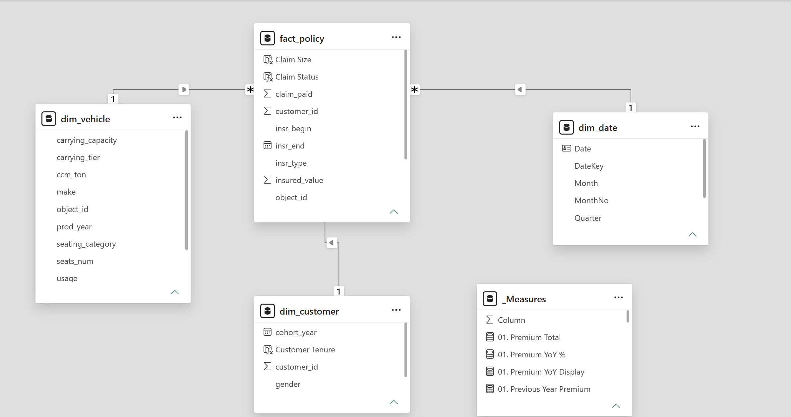

# 🚗 Vehicle Insurance Analytics Dashboard

[](https://powerbi.microsoft.com/)
[](https://en.wikipedia.org/wiki/SQL)


An interactive, end-to-end Power BI analytics solution designed to evaluate vehicle insurance policy trends, customer demographics, claims distributions, and premium revenues. This dashboard translates complex insurance data into actionable business insights for underwriting and operational strategies.

---

## 🎥 Walkthrough Video

Watch the short video demonstration below for a complete walkthrough of dashboard interactions, dynamic filtering, and KPI performance tracking:

<video src="Images/Project%20Overview%20Video.mp4" controls width="100%"></video>

> *Note: You can also download or view the video directly in the repository under [`Images/Project Overview Video.mp4`]

---

## 📊 Dashboard Preview & Screenshots

### Data Model Architecture


### Executive Overview Page


### Customer Analysis 


### Claim Analysis 


---

## 💡 Key Business Insights

- **Premium vs. Claim Ratio:** Real-time visibility into net profit margins across different vehicle classes and coverage types.
- **Demographic Breakdown:** Customer segmentation by age group,and driving history to evaluate high-risk vs. profitable profiles.
- **Claim Frequency & Severity:** Granular tracking of claims filed by monthly cohorts, identifying seasonal spikes in claim volume.

---

## 🛠️ Technical Architecture

### 1. Data Ingestion & Transformation (Power Query)
- Standardized and cleansed 500k+ historical policy and claim records.
- Handled null values, formatted dates, and built custom M-Query conditional columns for age tier grouping and claim status indexing.

### 2. Data Modeling (Star Schema)



- Designed an optimized **Star Schema** with `Fact_Claims` and `Fact_Policies` connected to dimension tables (`Dim_Customer`, `Dim_Vehicle`, `Dim_Date`, `Dim_Location`).
- Configured 1-to-many single-direction relationships to optimize DAX engine performance.

### 3. DAX Measures & Analytics
Calculated measures using DAX including:
- **Total Premium Revenue:** Sum of active policy premiums.
- **Total Claim Amount:** Aggregated payout values across resolved and pending claims.
- **Loss Ratio (%):** $\frac{\text{Total Claims}}{\text{Total Premiums}} \times 100$
- **YoY Growth:** Time-intelligence functions (`SAMEPERIODLASTYEAR`, `TOTALYTD`) for revenue and claim comparisons.

---

## 📁 Repository Structure

```text
vehicle_insurance_data/
│
├── .gitattributes                # Git LFS config for tracking video/large media
├── .gitignore                    # Excludes temporary PBI files and caches
├── README.md                     # Project documentation
│
├── Images/
│   ├── Dashboard_Overview.png    # High-resolution dashboard screenshot
│   ├── Claims_Analysis.png     # Detailed page screenshot
│   └── Project Overview Video.mp4 # Video demonstration (11 MB)
│
└── pbix/
    └── Insurance_Analysis.pbix   # Main Power BI Desktop file
